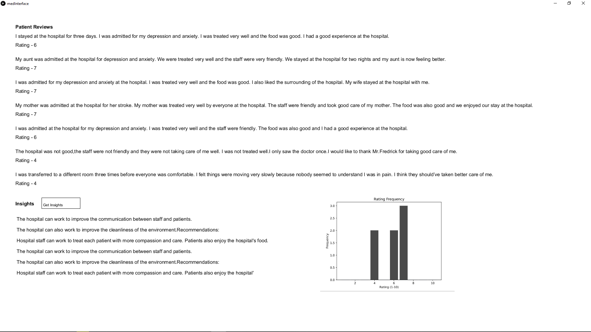

# HappyPatient - a new altruistic use case for AI in hospitals

This is a hackathon submission for HackAI 2021

HappyPatient improves hospital conditions by providing natural language insights on anonymized patient survey and review data. 
https://devpost.com/software/happypatient

The front end mockup for our app was made using java in processing and interfaces with a python script via a sockets server
